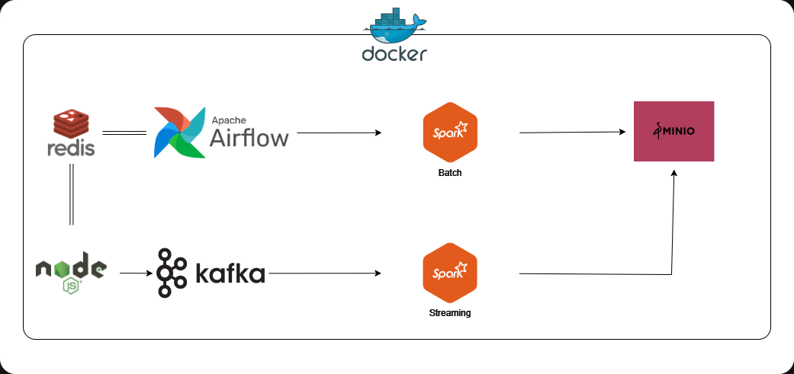

# Real time Kijiji Data Pipeline

```
The motivation behind this project was to develop an in depth understanding of different big data open source technologies and how they can be utilized to deploy a scalable data solution without a cloud vendor lock-in.
```

`Objective`: The task is to create a data processing pipeline which retrives Apartment Ratings data from [Open Data - City of Toronto](https://open.toronto.ca/dataset/apartment-building-evaluation/) and realtime apartment ratings data from [Kijiji](https://www.kijiji.com/). After that, the data will be processed and using **Spark Batch** and **Streaming** jobs and the resultant processed data is then stored in a AWS S3 compatible Minio Bucket. Entire pipeline is deployed using **Airflow** and **Docker**.

The task is broken down in following steps:
1. Download Apartment Evaluation data and load it to the `raw` Minio Bucket.
2. Process the downloaded data using `Spark` and load it to the `processed` Minio Bucket.
3. Scrape Kijiji data and push it to a `Kafka` Topic.
4. Process the `Kafka` messages using `Spark Streaming` and load it to the `processed` Minio Bucket.
5. Orchestrate the entire pipeline using `Airflow`.
6. Deploy the entire pipeline using `Docker Compose` for one click deployment.


## Architecture


- **Nodejs Application** : CRON job to continuously scrape data from Kijiji and push it to Kafka Topic for processing.
- **Redis** : Redis is used by the NodeJS applicaiton to keep a fingerprint of already processed data. This fingerprint is computed using `hasha` library on the Advertisment ID and Price to keep track of the updated prices of already processed ads.
- **Minio** : It is used as an object store alternative to S3.
- **Kafka** : Kafka is used as a message broker.
- **Spark Batch** : It is used to process raw CSV data from `raw` Minio Bucket and push it to `processed` Minio Bucket.
- **Spark Streaming** : It is used to process data coming from `Kafka` Topic and push it to `processed` Minio Bucket.
- **Airflow** : It is used to orchestrate the entire pipeline.


